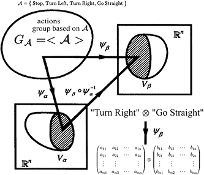

# Action-Group-Representation-Programming-for-Solving-Boolean-Equations
Solving Boolean Equations based on Action Group Representation Programming and Probability Field

-------------------------------------------------------------
### Requirements

You should install or compile following packs:

- BCS Solver:https://github.com/hzy-cas/BCS;
- FESLib Solver:https://github.com/cbouilla/libfes-lite;
- Keras and TensorFlow;
- CryptoMiniSat Solver;
- MFCS Solver(Not necessary):https://github.com/hzy-cas/MFCS;

All experiments in the thesis paper can be implemented in this project;
